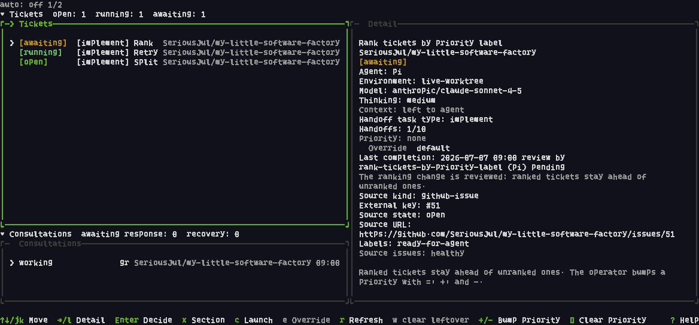
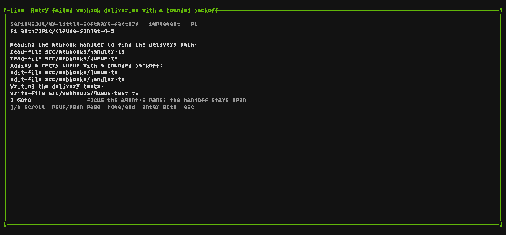

# my-little-software-factory

A little, focused, and opinionated control plane for software factories.
It is a single terminal screen with a clear mental model: the tickets a
repository cares about, one Agent running on the ticket, and the handoffs
between kinds of work.




The guides on the site hold everything this screen used to hold:

| Guide                                        | What it covers                                                       |
| -------------------------------------------- | -------------------------------------------------------------------- |
| [Getting started](./docs/getting-started/index.md) | Requirements, install, first screen, and the commands         |
| [Operation](./docs/operation/main-view.md)       | The Main view, Consultation, the modals, and the Live view     |
| [Work flow](./docs/work-flow/handoffs.md)        | Handoffs, model discovery, repository resolution, and completion |
| [Configuration](./docs/configuration/index.md)   | The complete example, the key reference, and the notes         |

## Requirements

- Node `26.4.0` or newer, and a current `npm`
- `herdr` on the `PATH`, with a current [ghostty](https://ghostty.org) on the
  `PATH` (herdr runs each Agent's terminal in ghostty), and `git`

[The Getting started guide](./docs/getting-started/index.md) covers the rest:
where each requirement comes from and how to get it, the config file, the
ticket sources, and the commands.

## Quick start

```bash
npx SeriousJul/my-little-software-factory
```

The control plane reads `~/.config/my-little-software-factory/config.toml`.
The shipped default carries no ticket sources, no repository mappings, and no
workflow edges: it holds the three agent types, the four workflow task types,
the three task rules, and the `consult` Consultation type. The
[Getting started guide](./docs/getting-started/index.md) shows how to add your
first ticket source. See [the Configuration guide](./docs/configuration/index.md)
for the complete example and the key reference.

## Happy path

1. The configured ticket sources fetch the tickets the repository cares
   about, and the ticket list shows them with their state.
2. Hold an `open` ticket and press `Enter`. The control plane resolves the
   ticket's suggested task type, checks that the settings fit the agent,
   finds the repository, and hands off: herdr creates the workspace and the
   agent terminal, and the agent runs on the repository.
3. The ticket moves to `handed-off` when the agent starts, and to `running`
   while it works. `Enter` on a working ticket opens the
   [Live view](./docs/operation/live-view.md), and you watch the Agent run on
   the repository.
4. The agent settles its turn. In manual mode the ticket rests in `awaiting`,
   and the decision modal asks what happens next: close the work cycle,
   route to the next kind of work, or goto the agent's pane. In
   auto-handoff mode, within the configured limits, it decides the settled
   turn without you (ADR 0016).

## Standards

The standards are the contracts a control screen must keep; ADRs are the
design decisions behind this one.

- [The shared control standard](./docs/shared-controls.md)
- [The architecture decision records](./docs/adr/)

## Contributing

For changes to controls, follow the shared control standard: use and extend
the shared modules in `src/components/shared`, and run `npm run gallery` to
see a control. See [CONTEXT.md](./CONTEXT.md),
[the shared control standard](./docs/shared-controls.md), and
[the verification record](./docs/verification/shared-controls.md) for the open
items.
