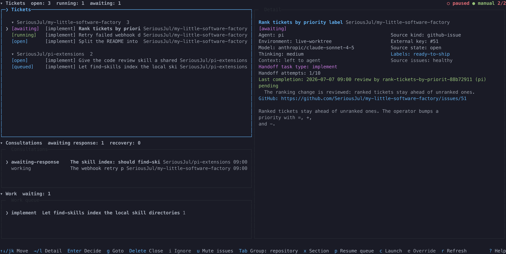
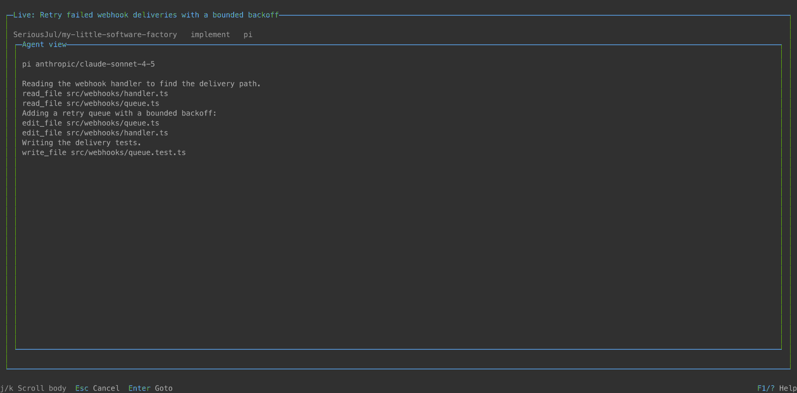

# my-little-software-factory

The one terminal screen that runs coding agents on your real tickets. It
watches the tickets your repositories care about, hands them to agents,
tracks every turn, and leaves the decisions to you when a turn settles.

- **Babysitting the agents is over.** A settled turn waits for your decision
  in manual mode, or routes on within your limits in auto mode.
- **One workflow, many repositories.** The same states, task types, and
  transitions run across every repository you point it at.
- **Many agents, one handoff.** Any agent type, any model, one screen - and
  the override panel edits a handoff's settings before it starts.




The guides on the site hold everything this screen used to hold:

| Guide                                        | What it covers                                                       |
| -------------------------------------------- | -------------------------------------------------------------------- |
| [Getting started](./docs/getting-started/prerequisites.md) | Prerequisites, the first launch, and the minimal config |
| [Operation](./docs/operation/main-view.md)       | The Main view, the Consultation, the modals, and the Live view      |
| [Work flow](./docs/work-flow/handoffs.md)        | The handoff setting chains, model discovery, and completion         |
| [Configuration](./docs/configuration/index.md)   | The complete example, the key reference, and the notes              |
| [Contributing](./docs/contributing/index.md)     | The development pages and the architecture decision records         |

## Requirements

- Node, for the `npx` that installs and runs the prebuilt binary the release
  publishes. The binary needs neither Node nor Bun on the machine.
- `herdr` on the `PATH`, with a current [ghostty](https://ghostty.org) on the
  `PATH` (herdr runs each Agent's terminal in ghostty), and `git`.
- The agent CLI of each agent type you use, with its own provider auth.
- Bun, only for the from-source path below.

[The Getting started guide](./docs/getting-started/prerequisites.md) covers
the rest, including the first-run warning on macOS and Windows and the GNU C++
runtime a musl machine needs.

## Quick start

The published binary, the default path:

```bash
npx my-little-software-factory
```

The first start downloads the binary and writes the default config to
`~/.config/my-little-software-factory/config.toml`; the shipped default
carries no ticket sources and no repository mappings, so
[the minimal config guide](./docs/getting-started/minimal-config.md) shows how
to add your first ticket source and repository mapping. See
[the Configuration guide](./docs/configuration/index.md) for the complete
example and the key reference.

Or run from source:

```bash
git clone https://github.com/SeriousJul/my-little-software-factory
cd my-little-software-factory
bun install
bun run start
```

The from-source run reads the same config file as the binary, with no hot
reload and no development config.

## Happy path

1. The configured ticket sources fetch the tickets the repository cares
   about, and the ticket list shows them with their state.
2. Hold an `open` ticket and press `Enter`: the plane resolves the task's
   settings, finds the repository, and hands off. herdr creates the
   workspace and the agent terminal, and the agent runs on the repository.
3. The ticket moves to `running` while the agent works, and `Enter` on a
   working ticket opens the [Live view](./docs/operation/live-view.md).
4. The agent settles its turn. In manual mode the ticket rests in `awaiting`,
   and the decision modal asks what happens next: close the work cycle, hand
   the ticket off to the next kind of work, or goto the agent's pane. In
   auto-handoff mode, within the configured limits, it decides the settled
   turn without you.

## Standards

The standards are the contracts a control screen must keep; ADRs are the
design decisions behind this one.

- [The shared control standard](./docs/development/shared-controls.md)
- [The architecture decision records](./docs/adr/index.md)

## Contributing

For changes to controls, follow the shared control standard: use and extend
the shared modules in `src/components/shared`, and run `bun run gallery` to
see a control. See [GLOSSARY.md](./GLOSSARY.md),
[the shared control standard](./docs/development/shared-controls.md), and
[the verification record](./docs/verification/shared-controls.md) for the open
items.
